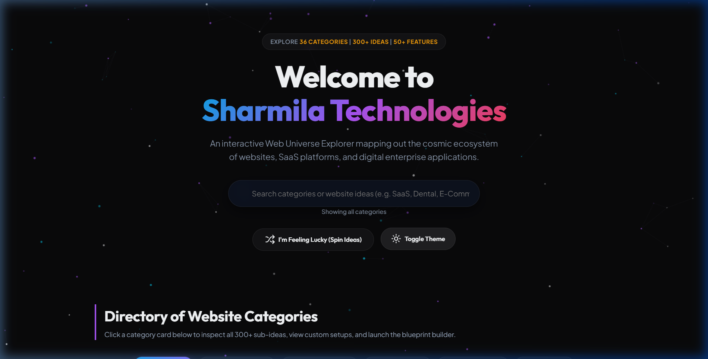

# Sharmila Technologies - Web Universe Explorer

An interactive, animated dashboard mapping out the cosmic ecosystem of websites, SaaS platforms, and digital enterprise applications. Explore 36 categories, 300+ sub-ideas, and 50+ modern features with real-time complexity calculations and custom blueprint manifestations.

---

## 🎨 Interactive Interface Showcase



---

## 🚀 Key Features

- **Directory of 36 Website Categories**: Explore over 300+ website subtypes categorized dynamically (Business, E-Commerce, Educational, AI-Powered, Specialized Industries, etc.).
- **Live Search Filters**: Instant global lookup across categories, descriptions, and sub-items.
- **Dynamic Category Tabs**: Browse and group the directories by broad ecosystems with smooth scale and opacity transition animations.
- **Detailed Sidebar Drawers**: Deep dive into sub-items with filter highlight matches. Send any sub-idea directly to the custom setup.
- **"I'm Feeling Lucky" Slot Wheel Spinner**: A slot-machine animation picker that randomized target categories, assigns 2-5 features, and compiles system stats.
- **Interactive Blueprint Configurator**: Toggle features (like *AI Chatbots*, *PWAs*, *WebSockets*, or *Authentication*) to instantly recalculate architecture, database tiers, timelines, and complexity scores.
- **Dual Themes**: Switch between a sleek, glassmorphic Dark Space theme and a high-contrast Slate Light theme.

---

## 🛠️ File Structure

- `index.html` - Base structural layout, modal drawers, and responsive configurator forms.
- `styles.css` - Custom style system, scrollbars, dynamic glassmorphic panels, and transitions.
- `app.js` - Data sets of all 36 categories, search indexing, slots engine, and theme controls.
- `screenshots/` - Holds user interface walkthrough screenshots.

---

## 💻 How to Run Locally

You can run this project locally using a lightweight HTTP server:

### Using Python:
```bash
python -m http.server 3000 --bind 127.0.0.1
```
Open **[http://127.0.0.1:3000](http://127.0.0.1:3000)** in your browser.

### Using Node (NPX):
```bash
npx http-server -p 3000
```
Open **[http://127.0.0.1:3000](http://127.0.0.1:3000)** in your browser.
